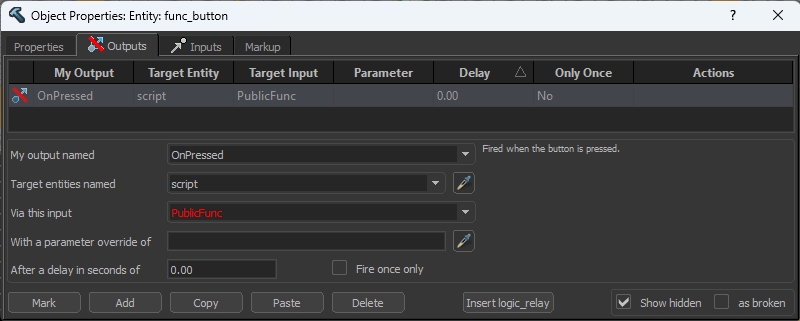
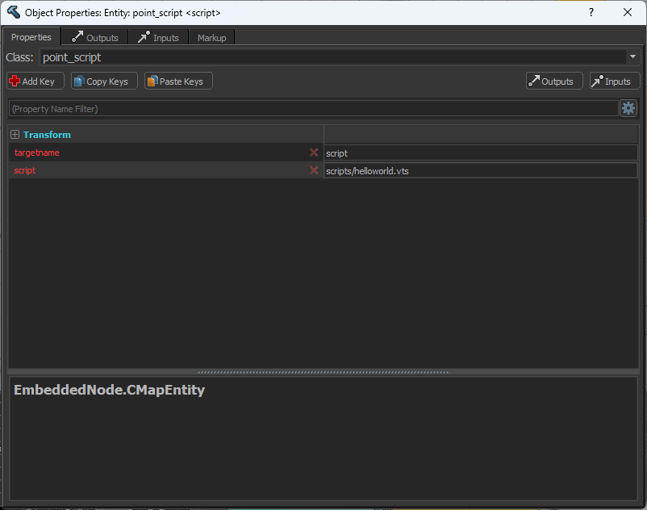

# Source 2 TypeScript
A counter strike 2 typescript bundler that automatically compiles `.vts` and `.ts` typescript files into valve `.vts_c` files, and bundles imported modules. Also includes type defintions for the `Instance` object used to interface with CS2.

## Features
- Partial type definitions for cspointscript's `Instance` class
- Utility functions such as `createEntity` and `runServerCommand`
- Auto compiling and transpiling `.vts` and `.ts` typescript files into javascript based `.vts_c`, the format needed to run in CS2 maps
- Auto bundling of imports from node modules

## Installation
Run `npx create-s2ts@latest` at the root of your map folder. The folder should be something like `/Steam/steamapps/common/Counter-Strike Global Offensive/content/csgo_addons/<map-name>`. This will setup a node project and create an example script.
```shell
npx create-s2ts@latest
```

Run the install:
```shell
npm install
```

## Usage (Compiler)
Once installed you can run with the start command:
```shell
npm run start
```

- While running, s2ts will look for any file updates to `.vts` and `.ts` files in your `/scripts` folder at `Counter-Strike Global Offensive/content/csgo_addons/<map-name>/scripts` and automatically compile then save them to `Counter-Strike Global Offensive/game/csgo_addons/<map-name>/scripts`.

- Public functions can be declared, for example `Instance.PublicMethod("PublicFunc", () => {})` and then these can be called from hammer's input/output system by triggering an output to the point_script entity with the name of the public function in the "Via this input" field.



- Public functions can also take string parameters but must be declared with the correct type, for example `Instance.PublicMethod("PublicFunc", (input: string) => {})`. Input in this case would be what ever is specified in the "With a parameter override of" field.

You can find an example typescript script at `/scripts/main.ts`. Update and save this script while s2ts is running, and the script will be compiled. If you are running your map, you must re-compile the map for this new script to take effect.

> [!NOTE]
> If you are using the example `maps/s2tsmap.vmap` map (Added as part of `create-s2ts` but can be downloaded [here](https://github.com/Peterclark1996/s2ts/raw/refs/heads/main/packages/create-s2ts/assets/s2tsmap.vmap)), then you can skip the next part of this section and look at "Utility Library Usage"

In hammer, you need to add a point_script entity that references your script. It should have a `targetname` key to allow other entities to trigger public methods in the script. It should also have a `script` key that references your script file. 
> [!IMPORTANT]
> Your script file path needs to have the `.vts` extension in hammer, even if it is a `.ts` file.



## Utility Library Usage
This project also provides some utility functions. These can be imported into your script from `s2ts/counter-strike`. To use any of these functions you need to be using the `maps/s2tsmap.vmap` example map (Added as part of `create-s2ts` but can be downloaded [here](https://github.com/Peterclark1996/s2ts/raw/refs/heads/main/packages/create-s2ts/assets/s2tsmap.vmap)), or set up the required entities yourself.

## Reference

[This repo](https://github.com/Ansimist/cs2typescript) for the structure of a vts_c file (Big thankyou)