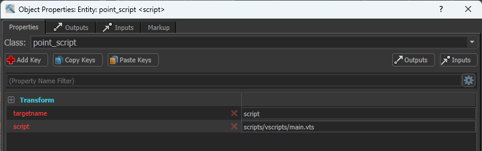

# Source 2 TypeScript
A counter strike 2 typescript compiler that automatically compiles `.vts` and `.ts` typescript files into valve `.vts_c` files. Also includes type defintions for the `Instance` object used to interface with CS2.

## Features
- Partial type definitions for cspointscript's `Instance` class
- Auto compile `.vts` and `.ts` typescript files into `.vts_c`, the format needed to run in CS2 maps
- Auto transpiling of typescript to javascript (Needed for `.vts_c` files)

## Installation
Run `npx create-s2ts` at the root of your map folder. The folder should be something like `/Steam/steamapps/common/Counter-Strike Global Offensive/content/csgo_addons/<map-name>`. This will setup a node project and create an example script.
```shell
npx create-s2ts
```

Run the install:
```shell
npm install
```

## Usage
Once installed you can run with the start command:
```shell
npm run start
```

1. While running, s2ts will look for any file updates to `.vts` and `.ts` files in your `/scripts` folder at `Counter-Strike Global Offensive/content/csgo_addons/<map-name>/scripts` and automatically compile then save them to `Counter-Strike Global Offensive/game/csgo_addons/<map-name>/scripts`.

2. In hammer, you need to add a point_script entity that references your script. It should have a `targetname` key to allow other entities to trigger public methods in the script. It should also have a `script` key that references your script file.


3. You can find an example typescript script at `/scripts/example.vts`. Update and save this script while s2ts is running, and the script will be compiled. Use the console to restart the game with `mp_restartgame 1` for the script update to take effect.

4. Functions declared via `Instance.PublicMethod()` can be called from the input/outputs system by calling the point_script entity with the name of the public function in the "Via this input" field.


## Reference

[This repo](https://github.com/Ansimist/cs2typescript) for the structure of a vts_c file (Big thankyou)